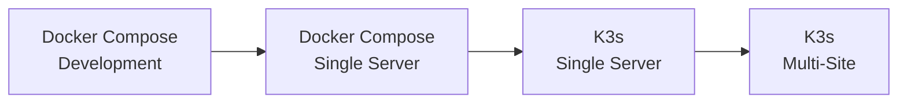
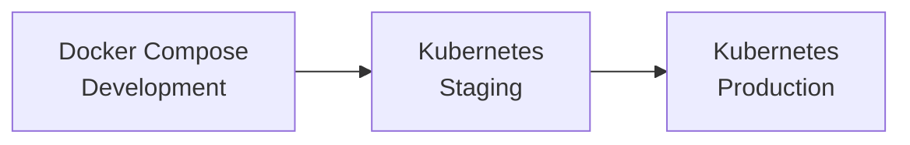

# Deployment Strategy: Docker Compose vs Kubernetes

## Executive Summary

This project supports **dual deployment strategies** to provide maximum flexibility for different environments and use cases. Users can choose between Docker Compose for simplicity or Kubernetes for production-grade orchestration.

---

## 🎯 Why Dual Deployment Support?

### The Challenge
Modern infrastructure teams face diverse deployment scenarios:
- **Development** environments need quick setup and easy debugging
- **Testing** environments need reproducibility and isolation
- **Production** environments need high availability and scalability
- **Edge/Industrial** deployments need lightweight, resilient solutions

### The Solution
By supporting both Docker Compose and Kubernetes, this project provides:

1. **Flexibility** - Choose the right tool for each environment
2. **Learning Path** - Start simple (Compose), scale up (Kubernetes)
3. **Cost Efficiency** - Use lightweight solutions where appropriate
4. **Production Readiness** - Deploy with confidence using K8s features

---

## 📊 Detailed Comparison

### Docker Compose

**Architecture:**
- Single-host orchestration
- Process-based isolation
- Shared kernel resources

**Strengths:**
- ✅ **Simplicity** - Single YAML file, one command to deploy
- ✅ **Speed** - Fastest setup time (< 5 minutes)
- ✅ **Resource Efficiency** - Minimal overhead
- ✅ **Debugging** - Easy to inspect logs and containers
- ✅ **Development** - Perfect for local development
- ✅ **Learning Curve** - Gentle introduction to containerization

**Limitations:**
- ❌ **Single Host** - Cannot span multiple servers
- ❌ **No Auto-Scaling** - Manual scaling only
- ❌ **Limited HA** - No automatic failover
- ❌ **Basic Health Checks** - Simple restart policies
- ❌ **No Rolling Updates** - Requires downtime for updates

**Best For:**
- Local development
- CI/CD testing
- Single-server deployments
- Proof of concepts
- Learning and experimentation

---

### Kubernetes/K3s

**Architecture:**
- Multi-host orchestration
- Pod-based isolation
- Declarative configuration

**Strengths:**
- ✅ **High Availability** - Multi-replica deployments with automatic failover
- ✅ **Auto-Scaling** - Horizontal Pod Autoscaling (HPA)
- ✅ **Rolling Updates** - Zero-downtime deployments
- ✅ **Self-Healing** - Automatic restart and rescheduling
- ✅ **Resource Management** - Advanced CPU/Memory controls
- ✅ **Service Discovery** - Built-in DNS and load balancing
- ✅ **Multi-Node** - Distribute workloads across servers
- ✅ **Ecosystem** - Rich tooling (Helm, Operators, etc.)

**Limitations:**
- ❌ **Complexity** - Steeper learning curve
- ❌ **Setup Time** - More initial configuration
- ❌ **Resource Overhead** - Control plane requires resources
- ❌ **Debugging** - More layers to troubleshoot

**Best For:**
- Production deployments
- Multi-node clusters
- High-availability requirements
- Auto-scaling workloads
- Enterprise environments
- Cloud-native applications

---

## 🏭 Industrial Monitoring Use Cases

### Scenario 1: Development & Testing
**Recommended: Docker Compose**

```bash
# Quick start for development
docker compose up -d
```

**Rationale:**
- Developers need fast iteration cycles
- Testing requires reproducible environments
- Resource constraints on development machines
- Easy to tear down and rebuild

---

### Scenario 2: Single Factory Server
**Recommended: Docker Compose or K3s**

**Docker Compose** if:
- Single server deployment
- Limited IT resources
- Simpler maintenance preferred
- No HA requirements

**K3s** if:
- Future multi-site expansion planned
- Want production-grade features
- Need resource management
- Require automated updates

---

### Scenario 3: Multi-Site Industrial Deployment
**Recommended: K3s on NixOS**

```nix
# nixos/server/configuration.nix
services.k3s.enable = true;
```

**Rationale:**
- **Distributed Systems** - Monitor multiple factories
- **Edge Computing** - K3s is lightweight (< 512MB RAM)
- **Declarative Config** - NixOS + K8s = Infrastructure as Code
- **Resilience** - Self-healing for remote sites
- **Centralized Management** - Single control plane

---

### Scenario 4: Cloud/Enterprise Production
**Recommended: Full Kubernetes (EKS/GKE/AKS)**

**Rationale:**
- **Scalability** - Handle thousands of nodes
- **High Availability** - Multi-zone deployments
- **Managed Services** - Cloud provider support
- **Advanced Features** - Service mesh, operators, etc.

---

## 🔄 Migration Paths

### Path 1: Compose → K3s (Recommended for Industrial)



**Steps:**
1. Develop and test with Docker Compose
2. Deploy to production server with Compose
3. Migrate to K3s for better management
4. Expand to multiple sites

---

### Path 2: Compose → Kubernetes (Cloud Migration)



**Steps:**
1. Develop locally with Docker Compose
2. Deploy to staging Kubernetes cluster
3. Validate and tune resource limits
4. Deploy to production Kubernetes

---

## 💡 Decision Matrix

Use this matrix to choose your deployment strategy:

| Criteria | Docker Compose | K3s | Full Kubernetes |
|----------|----------------|-----|-----------------|
| **Team Size** | 1-3 | 2-10 | 5+ |
| **Servers** | 1 | 1-10 | 10+ |
| **Budget** | Low | Medium | High |
| **Complexity Tolerance** | Low | Medium | High |
| **HA Required** | No | Yes | Yes |
| **Auto-Scaling** | No | Yes | Yes |
| **Cloud Native** | No | Partial | Yes |
| **Setup Time** | 5 min | 30 min | 1-2 hours |
| **Maintenance** | Low | Medium | Medium-High |

---

## 🛠️ Technical Implementation

### Shared Components

Both deployment methods use:
- ✅ **Same container images**
- ✅ **Same configuration files** (mounted differently)
- ✅ **Same monitoring dashboards**
- ✅ **Same alert rules**
- ✅ **Same security model** (mTLS, VPN, SOPS)

### Differences

| Aspect | Docker Compose | Kubernetes |
|--------|----------------|------------|
| **Config Format** | `docker-compose.yml` | YAML manifests |
| **Secrets** | `.env` file | `Secret` resources |
| **Config Files** | Volume mounts | `ConfigMap` resources |
| **Storage** | Named volumes | `PersistentVolumeClaim` |
| **Networking** | Docker networks | `Service` + DNS |
| **Health Checks** | `healthcheck:` | `livenessProbe` + `readinessProbe` |

---

## 📈 Performance Considerations

### Resource Overhead

**Docker Compose:**
- Control plane: ~0 MB (uses Docker daemon)
- Per-container overhead: ~10-20 MB

**K3s:**
- Control plane: ~300-500 MB
- Per-pod overhead: ~20-30 MB

**Full Kubernetes:**
- Control plane: ~1-2 GB (multi-node)
- Per-pod overhead: ~20-30 MB

### Startup Time

| Deployment | Cold Start | Warm Start |
|------------|------------|------------|
| Docker Compose | 30-60s | 10-20s |
| K3s | 60-120s | 20-40s |
| Full Kubernetes | 120-300s | 30-60s |

---

## 🔐 Security Comparison

Both deployments implement:
- ✅ mTLS for service communication
- ✅ SOPS for secret encryption
- ✅ WireGuard VPN for remote access
- ✅ Network isolation
- ✅ Authentication on all services

**Kubernetes Advantages:**
- ✅ RBAC (Role-Based Access Control)
- ✅ Network Policies for fine-grained control
- ✅ Pod Security Policies/Standards
- ✅ Service Accounts for workload identity

---

## 📚 Recommendations by Environment

### Development
**Use: Docker Compose**
- Fast iteration
- Easy debugging
- Minimal setup

### Staging/QA
**Use: Kubernetes (if prod uses K8s) or Docker Compose**
- Match production environment
- Test deployment procedures
- Validate resource limits

### Production (Single Server)
**Use: Docker Compose or K3s**
- Compose: Simpler, proven, stable
- K3s: Future-proof, better management

### Production (Multi-Server)
**Use: K3s or Full Kubernetes**
- K3s: Edge/Industrial deployments
- K8s: Cloud/Enterprise deployments

### Edge/Industrial
**Use: K3s on NixOS**
- Lightweight
- Declarative
- Resilient
- Perfect for distributed factories

---

## 🎓 Learning Path

1. **Start with Docker Compose**
   - Understand containerization
   - Learn service dependencies
   - Master configuration management

2. **Experiment with K3s**
   - Deploy on a single node
   - Learn Kubernetes concepts
   - Practice with kubectl

3. **Scale to Full Kubernetes**
   - Multi-node clusters
   - Advanced features
   - Production operations

---

## ✅ Conclusion

**Both deployment methods are first-class citizens in this project.**

Choose based on your:
- Current needs
- Team expertise
- Infrastructure constraints
- Future plans

**The beauty of this dual approach:**
You can start simple and evolve as your needs grow, without rewriting your application or losing your investment in configuration and monitoring.
